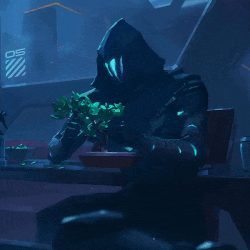

# 🤍 Olá, que bom ter você aqui! 

- 🎓 Estudante de análise e desenvolvimento de sistemas
- 📔 Atualmente aprendendo Flutter/Dart
- 🐦‍⬛ Foco em Java e posteriormente Front-end
  
---

# Skills

  
  
  
               

  
---

   
    

  

          

